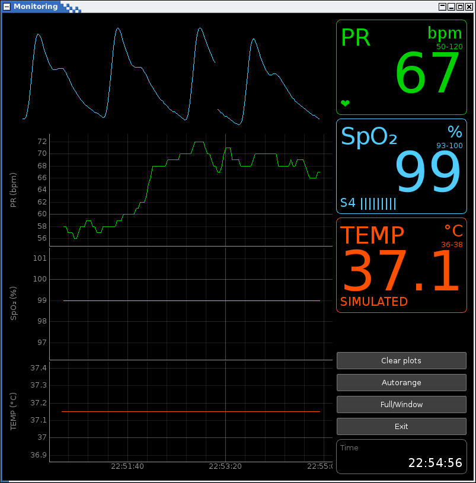

# Monitor
This is non professionnal side project. You'll not use a USB thing in life-critical situation. But still, recording data is fun!

# Graphical user interface
What it looks like. It's still a WIP. Maybe a day, i'll learn how make totally modular python applications.

# Oximeter hardware
I'm not sure about the oximeter name or brand. It connects to computer by USB and are easy to find on Aliexpress or eBay.

 The proprietary software is looking like this:

# Temperature hardware
TODO. Something wearable and wireless.
